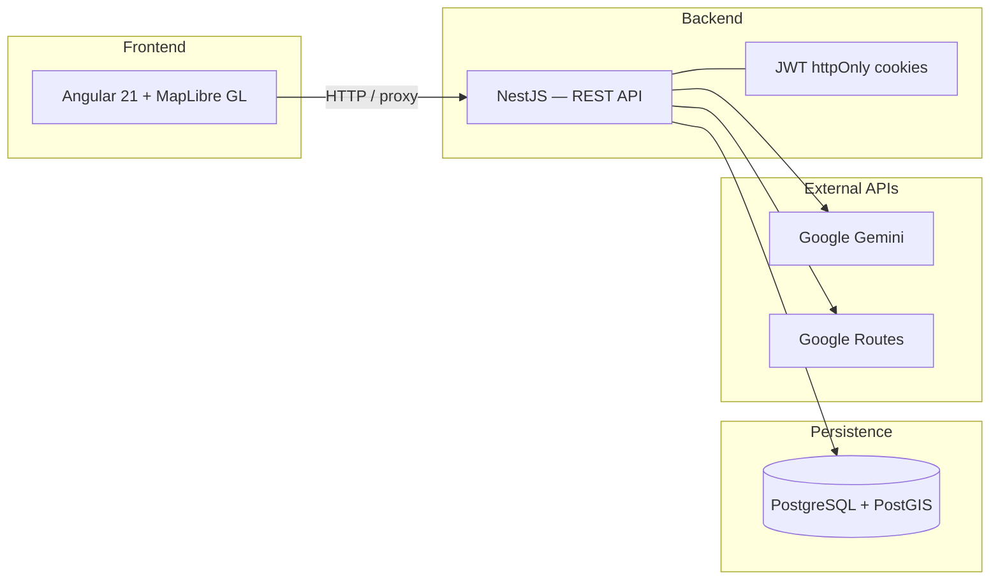
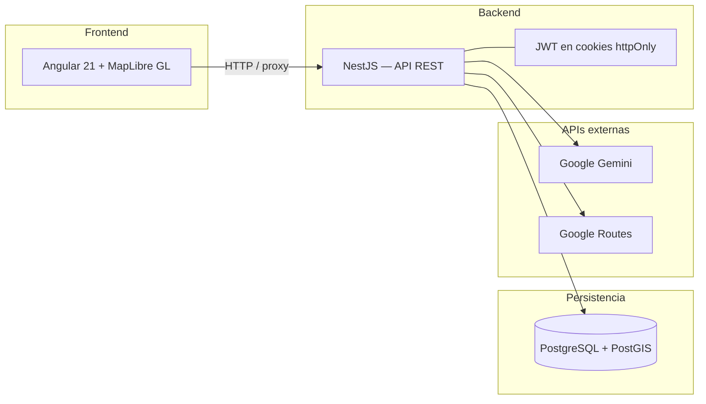

# UGR Eventos


**English** · [Español](#español)

---

# English

> University event management and visualization system based on an interactive map, geolocation, and artificial intelligence for the University of Granada ecosystem.

**Bachelor's Thesis** — BSc in Computer Engineering · ETSIIT · University of Granada · 2025–2026

---

## Preview

<!-- Replace with real screenshot: map with event markers -->


---

## About the project

Academic, cultural, and community activity at the University of Granada is often spread across fragmented channels — posters, email, social media, and faculty websites — making it hard to discover what is happening, where, and when.

**UGR Eventos** unifies **event management** and **geographic visualization** on an interactive map. The application supports differentiated identities (student and UGR staff), permissions based on the active session persona, public events and private meetings with invitations, a friends system, notifications, and a conversational AI assistant.

> Detailed academic documentation (analysis, design, implementation, and testing) is being written in the [`memoria/`](memoria/) folder.

---

## Screenshots

| Interactive map | Event detail / creation |
| :---: | :---: |
| <!-- TODO: map with event markers --> | <!-- TODO: event card or creation form --> |
|  |  |

| AI assistant | Profile / friends |
| :---: | :---: |
| <!-- TODO: assistant conversation --> | <!-- TODO: user profile or friends panel --> |
|  |  |

<!-- Optional: uncomment when admin screenshot is ready
| Admin panel |
| :---: |
|  |
-->

Screenshot guide: [`docs/screenshots/README.md`](docs/screenshots/README.md)

---

## Features

### Map & geolocation
- Interactive map with **MapLibre GL** and marker clustering
- Visual map themes (dawn, sunset, night)
- User geolocation and walking routes via **Google Routes API** *(optional)*

### Events
- Public events and private meetings with invitations
- Attendance, participants, and image management
- Personal lists filtered by role and active session persona

### Users & permissions
- Registration with onboarding and profiles (student / UGR staff)
- Active session persona selection (staff functions)
- System roles: user, moderator, manager, and administrator

### Social
- Friends system (requests, accept, reject)
- Invitation and activity notifications

### AI assistant
- Conversational chat with **Google Gemini** (server-side function calling)
- Create events and meetings, search friends, list events, and resolve faculty locations

### Administration
- Operator panel for user and event management

---

## Tech stack

| Layer | Technologies |
|-------|--------------|
| **Frontend** | Angular 21, MapLibre GL, Three.js, Supercluster, RxJS |
| **Backend** | NestJS 11, TypeORM, JWT in httpOnly cookies |
| **Database** | PostgreSQL 15 + PostGIS |
| **AI** | Google Gemini (`gemini-2.5-flash`) |
| **Routing** | Google Routes API |
| **Infrastructure** | Docker Compose |

---

## Architecture



### Repository structure

```
├── apps/
│   ├── frontend/     # Angular client (port 4200)
│   └── backend/      # NestJS API (port 3000)
├── memoria/          # LaTeX thesis document
├── docs/             # Additional docs and screenshots
└── docker-compose.yml
```

---

## Quick start

### Requirements

- [Docker](https://www.docker.com/) and Docker Compose
- Git

### Steps

1. **Clone the repository**

   ```bash
   git clone https://github.com/YOUR_USER/YOUR_REPO.git
   cd YOUR_REPO
   ```

2. **Configure environment variables**

   ```bash
   cd apps/backend
   cp .env.example .env    # Linux / macOS
   # copy .env.example .env  # Windows
   ```

   Fill in at least the JWT secrets (required). Gemini and Google Routes keys are optional for specific features:

   | Variable | Required | Purpose |
   |----------|:--------:|---------|
   | `JWT_ACCESS_SECRET` | Yes | Access token signing |
   | `JWT_REFRESH_SECRET` | Yes | Refresh token signing |
   | `GEMINI_API_KEY` | No | AI assistant |
   | `GOOGLE_ROUTES_API_KEY` | No | Map routing |

   Generate JWT secrets:

   ```bash
   node -e "console.log(require('crypto').randomBytes(32).toString('base64'))"
   ```

3. **Start the services**

   From the project root:

   ```bash
   docker compose up --build
   ```

4. **Open the application**

   - Frontend: [http://localhost:4200](http://localhost:4200)
   - Backend API: [http://localhost:3000](http://localhost:3000)
   - pgAdmin *(optional)*: [http://localhost:5050](http://localhost:5050)

### Demo data

The backend includes seed scripts to populate test users and events:

```bash
cd apps/backend
npm run seed:ugr-c-z
npm run seed:events-ugr-c-z
```

---

## External API configuration

- **Google Routes API** — [Setup guide](docs/google-routes-setup.md)
- **Google Gemini** — API key from [Google AI Studio](https://aistudio.google.com/apikey) → `GEMINI_API_KEY` in `.env`

API keys **must never** be placed in the frontend; only in `apps/backend/.env` (gitignored).

---

## Project status

| | |
|---|---|
| Working application | Map, events, friends, notifications, admin, AI assistant |
| Academic thesis | In progress ([`memoria/`](memoria/)) |
| Public demo | Not deployed; local execution with Docker |
| README screenshots | Pending — see [`docs/screenshots/`](docs/screenshots/) |

---

## Author

**Juan Pablo Escudero Ramírez**

- Degree: BSc in Computer Engineering
- Institution: ETSIIT — University of Granada
- Supervisor: Ángel Ruiz Zafra
- Academic year: 2025–2026

---

## License

Academic project developed as a Bachelor's Thesis. Contact the author before reusing the code for non-academic purposes.

---

---

# Español

[English](#english) · **Español**

> Sistema de gestión y visualización de eventos universitarios basado en mapa, localización e inteligencia artificial para el ecosistema de la Universidad de Granada.

**Trabajo Fin de Grado** — Grado en Ingeniería Informática · ETSIIT · UGR · Curso 2025–2026

---

## Vista previa

<!-- Sustituir por captura real: mapa con marcadores de eventos -->


---

## Sobre el proyecto

La actividad docente, cultural y de participación en la Universidad de Granada suele difundirse por canales dispersos — cartelería, correo, redes sociales y webs de centros —, lo que dificulta descubrir qué ocurre, dónde y cuándo.

**UGR Eventos** unifica la **gestión de eventos** y su **visualización geográfica** en un mapa interactivo. La aplicación contempla identidades diferenciadas (estudiante y personal UGR), permisos según la función activa en sesión, eventos públicos y reuniones privadas con invitaciones, sistema de amistades, notificaciones y un asistente conversacional con IA.

> Documentación académica detallada (análisis, diseño, implementación y pruebas) en redacción en la carpeta [`memoria/`](memoria/).

---

## Capturas

| Mapa interactivo | Detalle / creación de evento |
| :---: | :---: |
| <!-- TODO: captura del mapa con marcadores --> | <!-- TODO: captura de ficha o formulario de evento --> |
|  |  |

| Asistente IA | Perfil / amigos |
| :---: | :---: |
| <!-- TODO: conversación con el asistente --> | <!-- TODO: perfil de usuario o panel de amigos --> |
|  |  |

<!-- Opcional: descomentar cuando tengas la captura del panel admin
| Panel de administración |
| :---: |
|  |
-->

Guía para generar las capturas: [`docs/screenshots/README.md`](docs/screenshots/README.md)

---

## Funcionalidades

### Mapa y geolocalización
- Mapa interactivo con **MapLibre GL** y marcadores agrupados (clustering)
- Temas visuales del mapa (amanecer, atardecer, noche)
- Geolocalización del usuario y rutas a pie vía **Google Routes API** *(opcional)*

### Eventos
- Eventos públicos y reuniones privadas con invitaciones
- Asistencia, participantes y gestión de imágenes
- Listados personales filtrados por rol y persona activa en sesión

### Usuarios y permisos
- Registro con onboarding y perfiles (estudiante / personal UGR)
- Selección de persona activa en sesión (funciones del personal)
- Roles de sistema: usuario, moderador, manager y administrador

### Social
- Sistema de amistades (solicitudes, aceptar, rechazar)
- Notificaciones de invitaciones y actividad

### Asistente IA
- Chat conversacional con **Google Gemini** (function calling en backend)
- Crear eventos y reuniones, buscar amigos, listar eventos y resolver ubicaciones de facultades

### Administración
- Panel para gestión de usuarios y eventos (operadores)

---

## Stack tecnológico

| Capa | Tecnologías |
|------|-------------|
| **Frontend** | Angular 21, MapLibre GL, Three.js, Supercluster, RxJS |
| **Backend** | NestJS 11, TypeORM, JWT en cookies httpOnly |
| **Base de datos** | PostgreSQL 15 + PostGIS |
| **IA** | Google Gemini (`gemini-2.5-flash`) |
| **Rutas** | Google Routes API |
| **Infraestructura** | Docker Compose |

---

## Arquitectura



### Estructura del repositorio

```
├── apps/
│   ├── frontend/     # Cliente Angular (puerto 4200)
│   └── backend/      # API NestJS (puerto 3000)
├── memoria/          # Memoria LaTeX del TFG
├── docs/             # Documentación complementaria y capturas
└── docker-compose.yml
```

---

## Instalación rápida

### Requisitos

- [Docker](https://www.docker.com/) y Docker Compose
- Git

### Pasos

1. **Clonar el repositorio**

   ```bash
   git clone https://github.com/TU_USUARIO/TU_REPO.git
   cd TU_REPO
   ```

2. **Configurar variables de entorno**

   ```bash
   cd apps/backend
   copy .env.example .env    # Windows
   # cp .env.example .env    # Linux / macOS
   ```

   Rellena al menos los secretos JWT (obligatorios). Las claves de Gemini y Google Routes son opcionales para funciones concretas:

   | Variable | Obligatoria | Uso |
   |----------|:-----------:|-----|
   | `JWT_ACCESS_SECRET` | Sí | Firma del access token |
   | `JWT_REFRESH_SECRET` | Sí | Firma del refresh token |
   | `GEMINI_API_KEY` | No | Asistente IA |
   | `GOOGLE_ROUTES_API_KEY` | No | Rutas en el mapa |

   Generar secretos JWT:

   ```bash
   node -e "console.log(require('crypto').randomBytes(32).toString('base64'))"
   ```

3. **Levantar los servicios**

   Desde la raíz del proyecto:

   ```bash
   docker compose up --build
   ```

4. **Abrir la aplicación**

   - Frontend: [http://localhost:4200](http://localhost:4200)
   - Backend API: [http://localhost:3000](http://localhost:3000)
   - pgAdmin *(opcional)*: [http://localhost:5050](http://localhost:5050)

### Datos de demo

El backend incluye scripts de seed para poblar usuarios y eventos de prueba:

```bash
cd apps/backend
npm run seed:ugr-c-z
npm run seed:events-ugr-c-z
```

---

## Configuración de APIs externas

- **Google Routes API** — [Guía de configuración](docs/google-routes-setup.md)
- **Google Gemini** — Clave en [Google AI Studio](https://aistudio.google.com/apikey) → `GEMINI_API_KEY` en `.env`

Las claves **nunca** van en el frontend; solo en `apps/backend/.env` (excluido de git).

---

## Estado del proyecto

| | |
|---|---|
| Aplicación funcional | Mapa, eventos, amistades, notificaciones, admin, asistente IA |
| Memoria académica | En redacción ([`memoria/`](memoria/)) |
| Demo pública | No desplegada; ejecución local con Docker |
| Capturas del README | Pendientes — ver [`docs/screenshots/`](docs/screenshots/) |

---

## Autor

**Juan Pablo Escudero Ramírez**

- Titulación: Grado en Ingeniería Informática
- Centro: ETSIIT — Universidad de Granada
- Tutor: Ángel Ruiz Zafra
- Curso académico: 2025–2026

---

## Licencia

Proyecto académico desarrollado como Trabajo Fin de Grado. Consultar con el autor antes de reutilizar el código con fines no académicos.
