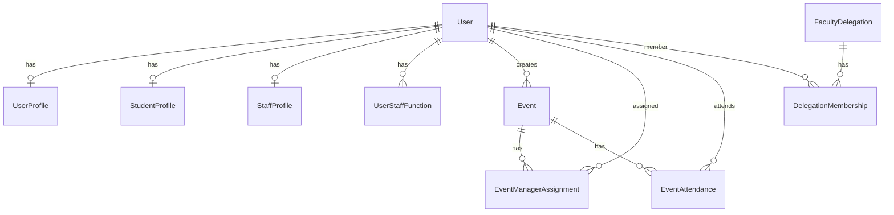

# Chat recuperado: subagents

## USER

Explore the NestJS backend at g:\JP\TFG\TFG---Aplicaci-n-de-gesti-n-de-eventos-orientados-a-la-UGR\apps\backend

Find and summarize:
1. All TypeORM entities and their relationships
2. User/auth module structure (userNumber, profiles)
3. How modules are organized (controller/service patterns)
4. Any existing friendship or social features
5. Migration/synchronize setup

Return file paths and key fields for users, profiles. List all entity file paths.

## ASSISTANT

Exploring the NestJS backend structure, entities, and auth configuration.

[REDACTED]

## ASSISTANT

[REDACTED]

## ASSISTANT

[REDACTED]

## ASSISTANT

[REDACTED]

## ASSISTANT

[REDACTED]

## ASSISTANT

[REDACTED]

## ASSISTANT

[REDACTED]

## ASSISTANT

# NestJS backend exploration summary

Base path: `g:\JP\TFG\TFG---Aplicaci-n-de-gesti-n-de-eventos-orientados-a-la-UGR\apps\backend`

---

## 1. TypeORM entities and relationships

There are **10 entity files**. `User` is the hub; events and delegation link to users by FK.

### Entity relationship overview

| Entity | Table | Key relations |
|--------|-------|----------------|
| **User** | `users` | 1:1 `UserProfile`, 1:1 `StudentProfile`, 1:1 `StaffProfile`, 1:N `UserStaffFunction` |
| **UserProfile** | `user_profiles` | 1:1 `User` (owns `@JoinColumn`, CASCADE delete) |
| **StudentProfile** | `student_profiles` | 1:1 `User` (owns FK) |
| **StaffProfile** | `staff_profiles` | 1:1 `User` (owns FK) |
| **UserStaffFunction** | `user_staff_functions` | N:1 `User`; unique `(user, function)` |
| **Event** | `events` | N:1 `User` as `creator` (`creatorId`) |
| **EventManagerAssignment** | `event_manager_assignments` | N:1 `Event`, N:1 `User`; unique `(eventId, userId)`; role `EDITOR` \| `MODERATOR` |
| **EventAttendance** | `event_attendances` | N:1 `Event`, N:1 `User`; unique `(eventId, userId)` |
| **FacultyDelegation** | `faculty_delegations` | No TypeORM inverse; unique `faculty` |
| **DelegationMembership** | `delegation_memberships` | N:1 `FacultyDelegation`, N:1 `User`; unique `(delegationId, userId)` |

**Notes:**
- Child 1:1 profiles (`UserProfile`, `StudentProfile`, `StaffProfile`) hold the foreign key via `@JoinColumn`.
- `Event`, `FacultyDelegation` do not declare `@OneToMany` back-relations; joins are only on child entities.
- `StudentProfile` / `StaffProfile` on `User` are optional in practice (created during onboarding by email domain).

---

## 2. User / auth module structure

### Modules

| Module | Path | Role |
|--------|------|------|
| **AppModule** | `src\app.module.ts` | `TypeOrmModule.forRoot`, imports `AuthModule`, `EventsModule` only |
| **AuthModule** | `src\modules\auth\auth.module.ts` | JWT (global), `AuthService`, `AuthController`, global `JwtAuthGuard` |
| **UsersModule** | `src\modules\user\user.module.ts` | `UsersService`, `CapabilityService`, `UsersController`; exports services to auth/events |
| **EventsModule** | `src\modules\events\events.module.ts` | `EventsService`, `EventsController`; imports `UsersModule` |

`UsersModule` is **not** registered in `AppModule`; it is pulled in via `AuthModule` and `EventsModule`.

### Auth flow (`AuthService` + `AuthController`)

- **Register** (`POST /auth/register`): bcrypt password, `operatorKey` → `SystemRole`, creates `User` + nested `UserProfile` with random **`userNumber`** (6-digit) and `userName` = email local-part.
- **Login** (`POST /auth/login`): JWT access (15m) + refresh (7d) in HTTP-only cookies; returns `toPublicSession(user)`.
- **Me** (`GET /auth/me`): session payload from JWT `sub`.
- **Refresh / logout**: refresh token hashed on `User.hashedRefreshToken`.

### Profiles and `userNumber`

| Concept | Location | Purpose |
|---------|----------|---------|
| **`userNumber`** | `UserProfile.userNumber` | Public identifier (unique int, 100000–999999 at register); used in `GET /user/public/:userNumber`, event manager invites |
| **`userName`** | `UserProfile.userName` | Unique display handle (initially email prefix) |
| **Base profile** | `UserProfile` | Personal data: names, birthDate, gender, phone, bio, picture |
| **Student** | `StudentProfile` | `faculty`, `campus`, `degree` (enums) for `@correo.ugr.es` |
| **Staff** | `StaffProfile` | `department` for `@ugr.es` teaching roles |
| **Staff functions** | `UserStaffFunction` + `User.activeStaffFunction` | Multiple university roles; session “persona” when >1 function |
| **Onboarding** | `User.onboardingCompleted`, `PATCH /user/onboarding` | Email-driven student vs staff completion rules in `UsersService` |

### Key fields — **User** (`user.entity.ts`)

- `id`, `email` (unique), `password`, `role` (`SystemRole`), `onboardingCompleted`, `activeStaffFunction`, `hashedRefreshToken`, `createdAt`, `updatedAt`

### Key fields — **UserProfile** (`user-profile.entity.ts`)

- `id`, **`userName`** (unique), **`userNumber`** (unique), `firstName`, `lastName`, `birthDate`, `gender`, `phoneNumber`, `bio`, `profilePicture`, relation → `user`

### User API (`UsersController`, prefix `user`)

- `GET /user/profile` — full profile for authenticated user  
- `GET /user/public/:userNumber` — limited public view (email only if owner)  
- `PATCH /user/profile`, `/user/onboarding`, `/user/session-persona`

Supporting: `src\modules\user\user-enums.ts` (`SystemRole`, `StaffFunction`, `UserFaculty`, `UserDegree`, etc.), `capability.service.ts` (capabilities from active staff function).

---

## 3. Module organization (controller / service pattern)

Standard Nest feature layout under `src\modules\\`:

- **`.module.ts`** — `TypeOrmModule.forFeature([...entities])`, providers, controllers  
- **`.controller.ts`** — HTTP routes, `@Request() req.user.sub` from JWT  
- **`.service.ts`** — business logic, repositories  
- **`dto/`** — validation DTOs  
- **`*.entity.ts`** — TypeORM models  

**Auth:** `auth.controller.ts` + `auth.service.ts` + `auth.guard-jwt.ts` + `public.decorator.ts` + DTOs/validators.

**User:** `user.controller.ts` + `user.service.ts` + `capability.service.ts`.

**Events:** `events.controller.ts` + `events.service.ts` (uses `UsersService.findByProfileUserNumber` for co-managers).

**Delegation:** entities only under `src\modules\delegation\` — **no** `delegation.module`, controller, or service.

**Root:** `app.controller.ts` / `app.service.ts`; `main.ts` sets CORS, cookies, global `ValidationPipe`, `ClassSerializerInterceptor`.

---

## 4. Friendship / social features

**No friendship, follow, or contact-graph features** were found (no friend/request entities, services, or routes).

Closest “social” behavior:

- **Public profile by `userNumber`** — `GET /user/public/:userNumber`  
- **Event attendance** — `POST/DELETE /events/:id/attendance` (`EventAttendance`)  
- **Event co-managers** — `EventManagerAssignment` by `userNumber` in create-event DTO  
- **Delegation membership** — organizational (`DelegationMembership`), not peer friendship; **no API implemented**

Grep for `friend`, `follow`, etc. only hits faculty/degree label strings and Nest README badges.

---

## 5. Migration / synchronize setup

Configured in `src\app.module.ts`:

- **PostgreSQL** (`events_db`, env `DB_HOST` / `DB_PORT`, hardcoded credentials in dev)
- **`synchronize: true`** — schema auto-created/updated from entities (comment: disable in production)
- **No** `migrations` array, `migrationsRun`, or `migrations` folder under `apps\backend`
- All 10 entities listed explicitly in `entities: [...]`

Delegation tables are synced at root but have no feature module using them yet.

---

## All entity file paths (absolute)

1. `g:\JP\TFG\TFG---Aplicaci-n-de-gesti-n-de-eventos-orientados-a-la-UGR\apps\backend\src\modules\user\user.entity.ts`
2. `g:\JP\TFG\TFG---Aplicaci-n-de-gesti-n-de-eventos-orientados-a-la-UGR\apps\backend\src\modules\user\user-profile.entity.ts`
3. `g:\JP\TFG\TFG---Aplicaci-n-de-gesti-n-de-eventos-orientados-a-la-UGR\apps\backend\src\modules\user\student-profile.entity.ts`
4. `g:\JP\TFG\TFG---Aplicaci-n-de-gesti-n-de-eventos-orientados-a-la-UGR\apps\backend\src\modules\user\staff-profile.entity.ts`
5. `g:\JP\TFG\TFG---Aplicaci-n-de-gesti-n-de-eventos-orientados-a-la-UGR\apps\backend\src\modules\user\user-staff-function.entity.ts`
6. `g:\JP\TFG\TFG---Aplicaci-n-de-gesti-n-de-eventos-orientados-a-la-UGR\apps\backend\src\modules\events\event.entity.ts`
7. `g:\JP\TFG\TFG---Aplicaci-n-de-gesti-n-de-eventos-orientados-a-la-UGR\apps\backend\src\modules\events\event-manager-assignment.entity.ts`
8. `g:\JP\TFG\TFG---Aplicaci-n-de-gesti-n-de-eventos-orientados-a-la-UGR\apps\backend\src\modules\events\event-attendance.entity.ts`
9. `g:\JP\TFG\TFG---Aplicaci-n-de-gesti-n-de-eventos-orientados-a-la-UGR\apps\backend\src\modules\delegation\faculty-delegation.entity.ts`
10. `g:\JP\TFG\TFG---Aplicaci-n-de-gesti-n-de-eventos-orientados-a-la-UGR\apps\backend\src\modules\delegation\delegation-membership.entity.ts`

---

## Quick reference: user / profile source files

| File | Role |
|------|------|
| `...\user\user.entity.ts` | Auth account + relations |
| `...\user\user-profile.entity.ts` | `userNumber`, `userName`, personal fields |
| `...\user\student-profile.entity.ts` | Student academic fields |
| `...\user\staff-profile.entity.ts` | Staff `department` |
| `...\user\user-staff-function.entity.ts` | Many staff roles per user |
| `...\user\user.service.ts` | CRUD, onboarding, `generateUniqueUserNumber`, public profile |
| `...\user\user.controller.ts` | Profile HTTP API |
| `...\auth\auth.service.ts` | Register/login/session |
| `...\auth\auth.module.ts` | Wires auth + global JWT guard |

[REDACTED]
